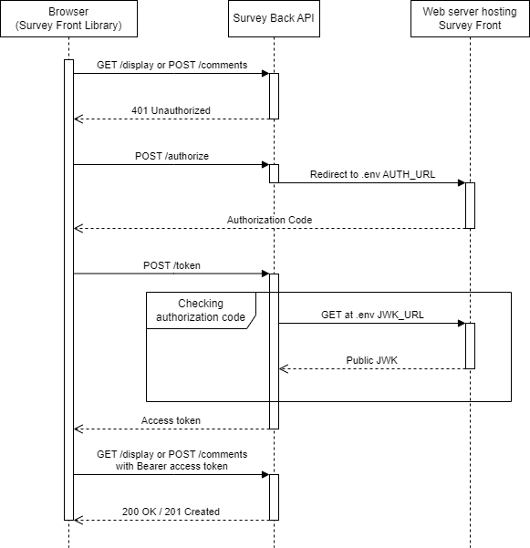

The security of the Survey apps comes in 2 layers.

The first is the **CORS Policy**, to prevent cross-site request forgery (CSRF), which you can define in the `.env` file of Survey Back API.

The second is a full **OpenID Connect-like flow** to protect all communications between Survey Back API, Front Library, and any third party allowed to use the Back API.  
If you would prefer to implement your own system, this can be disabled by leaving empty the `SECRET_KEY` value in the `.env` file of Survey Back API.

In addition to the open POST /authorize and /token routes for authentication, the Back API contains 2 scopes:
- client: for GET /display and POST /comments. This is the scope used by the Front Library;
- data: for all other GET routes and retrieving the comments, configuration and statistics;

To use the **data scope** and allow yourself or a third party (such as our BugPrediction tool) to fetch data, you need to use the [client credentials](https://oauth.net/2/grant-types/client-credentials/) flow.
- First register the external app by adding a client secret to the list `CLIENT_SECRETS` in the `.env` file of Survey Back API. You can generate a client secret by running `openssl rand -hex 32` in cmd. The client id is the position (index+1) of the secret in the list;
- Then, from the external app, make a POST request to /token with grant_type as `client_credentials` and your client_id and client_secret;
- If the id and secret are correct, you will be returned an access token to use with as a Bearer token in your requests;

The use of the **client scope** is managed automatically by the Front Library, there is however some configuration to add.
Since the Front Library is entirely within the user's browser, we can't securely use client credentials. We therefore use a hybrid flow, similar to OpenID Connect, which relies on the authentication of the host website.



First you have to give an `AUTH_URL` in the `.env` file of Survey Back API and create this endpoint on your web server.  
Credentials are passed with the request and through the redirect so you can authenticate the user as you normally would.  
You then need to return an authorization code, which is a JWT signed using a private key from RSA (RS256).  
For the Back API to verify this code, you need to expose the public key at the endpoint given in `JWK_URL` in the `.env` file of Survey Back API. Make sure it has a key ID (`kid`) and the field `use` set as `sig`. For instance, this is what the public JWK looks like for Google APIs https://www.googleapis.com/oauth2/v3/certs.

Here is an example in Python/FastAPI of how you can generate the keys with `jwcrypto` and sign the authorization code with `PyJWT`:
```py
from fastapi import FastAPI
from fastapi.middleware.cors import CORSMiddleware
import jwt
from jwcrypto import jwk
from datetime import datetime, timedelta

app = FastAPI()
app.add_middleware(
    CORSMiddleware,
    allow_origins="*",
    allow_credentials=True,
    allow_methods="*",
    allow_headers="*",
)

key = jwk.JWK.generate(kty="RSA", size=2048, alg="RS256", use="sig", kid="1234")
public_key = key.export_public(as_dict=True)
private_key = key.export_to_pem(private_key=True, password=None)

@app.post("/authorize")
async def authorize():
    # Authenticate the user here
    expire = datetime.utcnow() + timedelta(minutes=1)
    to_encode = {"exp": expire}
    auth_code = jwt.encode(to_encode, private_key, algorithm="RS256")
    return {"code": auth_code}

@app.get("/jwk")
def get_jwk():
    return {"keys": [public_key]}
```